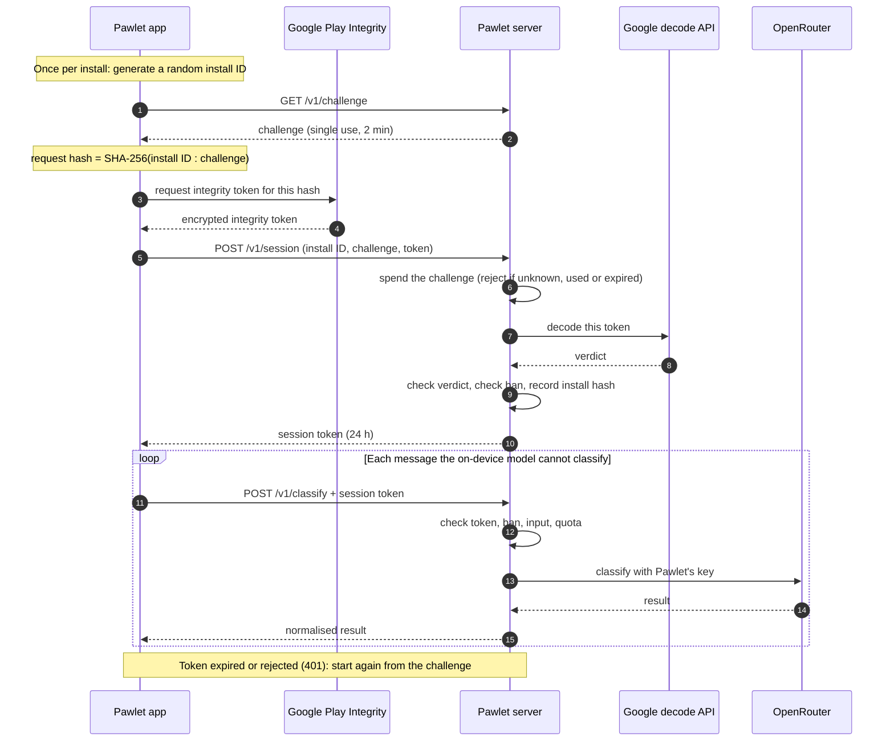

# Auth flow

How the server decides that a request really comes from the Pawlet app, installed from Google
Play, on a genuine Android device — without user accounts, emails or any personal data.

> **Status:** the server side described here is live. The app side is **not built yet**, so no
> app currently runs this flow. Where this page describes what the app does, it describes the
> contract the server expects.

## Why this exists

The server holds Pawlet's OpenRouter API key and uses it to classify SMS messages the
on-device model cannot handle. That key costs money, so the server must refuse anyone who is
not the real app. Pawlet has no sign-up, so there is no password to check. Instead, the app
asks **Google** to vouch for it, and the server checks Google's answer.

## The pieces

| Piece | What it is | Why it is needed |
|---|---|---|
| **Install ID** | A long random value the app generates once and keeps in the phone's secure storage. | Identifies an install anonymously, so the server can apply per-install limits and ban one install without knowing who the user is. The server only ever stores its SHA-256 hash. |
| **Challenge** | 32 random bytes the server hands out, valid for 2 minutes and usable once. | Proves the request is happening *now*. A recorded request can't be replayed, because its challenge is already spent. |
| **Request hash** | SHA-256 of the install ID, a colon, and the challenge, in hex. | Binds Google's answer to one specific install ID *and* one specific challenge, so a valid answer can't be reused under a different identity. The colon stops two different pairs from producing the same text. |
| **Integrity token** | An encrypted, Google-signed blob the app gets from Google Play Integrity, containing the request hash. | The proof itself. The app cannot read or change it. Only Google can open it. |
| **Verdict** | What Google says the token contains: the app's package name, whether Play recognises this build, the app's signing-certificate fingerprint, and whether the device is genuine. | The server's decision is based entirely on this. |
| **Session token (JWT)** | A token the server signs and gives the app, valid for 24 hours. | Asking Google costs time and quota, so the app attests once a day and uses this token for every call in between. |

## The flow, start to finish

### 1. Get a challenge — `GET /v1/challenge`

The app asks for a challenge. The server generates 32 random bytes, remembers them in memory
for 2 minutes, and returns them as hex. Challenges are deliberately not saved to the database,
so a server restart just means the app asks for a new one.

This endpoint needs no login, so it is rate-limited per client IP address to stop anyone
making the server remember millions of challenges.

### 2. Ask Google to vouch for the app — on the phone

The app combines its install ID and the challenge into the request hash and asks Google Play
Integrity for a token bound to that hash. Google inspects the app and the device, then returns
an encrypted token. The phone passes it on without being able to read it.

### 3. Exchange the proof for a session — `POST /v1/session`

The app sends its install ID, the challenge and the integrity token. The server then works
through these steps in order, and stops at the first failure:

1. **Spend the challenge.** It must exist, be unused and be under 2 minutes old, and it is
   deleted on the spot. This runs *before* asking Google, so a replayed request is turned away
   without spending any Google quota.
2. **Ask Google to decode the token.** The server forwards the token to Google, authenticated
   with Pawlet's Google service account, and gets the verdict back over its own connection.
   This is why the verdict can be trusted: it comes from Google, not from the phone.
3. **Check the verdict.** All of these must hold:
   - the package name is Pawlet's;
   - the request hash matches the one the server recomputes from the install ID and challenge;
   - the token was issued within the last 5 minutes;
   - Google Play recognises this exact build of the app;
   - the app is signed with Pawlet's Play app-signing certificate (see below);
   - the device passes Google's device-integrity check.
4. **Check the ban list.** A banned install is refused here.
5. **Record the install.** The server saves the install ID's SHA-256 hash and when it was
   first and last seen. Nothing else about the install or the user is stored.
6. **Issue a session token.** A JWT valid for 24 hours whose subject is the install hash.

The checks live in `internal/attest/verify.go`; the endpoint is `internal/httpapi/session.go`.

### 4. Use the session — `POST /v1/classify`

Every classification request carries the session token. The server:

1. **checks the token** — its signature and expiry. A token the server did not sign, or one
   claiming to need no signature, is rejected;
2. **checks the install still exists and is not banned**, so a ban takes effect immediately
   even for an install holding a valid token;
3. **checks the input** — sizes and the currency code;
4. **checks the quota** — a short burst limit and a daily limit per install, plus a daily
   ceiling across all installs so a sudden surge cannot drain the OpenRouter account;
5. **calls OpenRouter** with Pawlet's key and returns the cleaned-up result.

Message content is never written to disk and never logged. The endpoint is
`internal/httpapi/classify.go`.

### 5. Renewing

After 24 hours, or whenever the server answers 401, the app starts again from step 1.

## The signing-certificate check

Every Android app is signed. Google measures the fingerprint (a SHA-256 hash) of the
certificate the installed app is signed with and puts it in the verdict. The server compares
it against the fingerprints listed in `CERT_SHA256_DIGESTS`.

This is what stops a **modified copy** of the app. Someone can unpack the APK, change it and
re-install it, but they then have to sign it with their own key, which gives a different
fingerprint. Copying the package name doesn't help, because the package name is just text.

Two details that catch people out:

- The fingerprint to configure is the **Play app-signing** certificate, not your upload
  certificate. Play re-signs every build it distributes with its own key, so that is the
  certificate the installed app actually carries.
- It must be written in **base64url** form, because that is how Google reports it and the
  server compares the text exactly. Play Console shows the same fingerprint as
  colon-separated hex, which will never match.

The fingerprint itself is not secret. Anyone can read it from the APK. The protection comes
from Google being the one who reports it.

## What the app sees when something fails

| Status | Error | Meaning | What the app should do |
|---|---|---|---|
| 400 | `bad_request` | The request is malformed or missing a field. | Treat as a bug; don't retry. |
| 400 | `upstream_rejected` | OpenRouter refused this request outright. | Don't retry the same message. |
| 401 | `unauthorized` | The session token is missing, invalid, expired, or for an unknown install. | Get a new session (start again from the challenge). |
| 403 | `attestation_failed` | The challenge was unknown, used or expired, or Google's verdict failed a check. | Usually permanent for this device or build. |
| 403 | `banned` | This install has been banned. | Stop using the server. |
| 429 | `rate_limited` | A rate limit or quota was hit, either the server's or OpenRouter's. Usually comes with a `Retry-After` header. | Wait at least that long. |
| 503 | `attestation_unavailable` | The server couldn't get an answer from Google. | Retry later; this is the server's problem, not the device's. |
| 503 | `capacity` | The daily ceiling across all installs was reached. | Retry later. |
| 503 | `upstream` | OpenRouter failed or is unavailable. | Retry later. |

A failure to reach Google returns **503**, not 403, on purpose. A 403 tells the app its
device is permanently ineligible; an outage on Google's side or a server misconfiguration
must never be mistaken for that.

When attestation fails, the server log records exactly which check failed, even though the
app only ever sees the generic `attestation_failed`.

## What this does and doesn't protect against

**It stops:** other people's scripts calling the server; modified or repackaged copies of the
app; emulators and rooted or tampered devices; replaying a captured request; reusing one
genuine token under many install IDs.

**It doesn't stop:** a determined attacker running the real, unmodified app on a real device
and automating it. Play Integrity raises the cost of abuse but cannot make it impossible.
That is what the per-install quota, the global daily ceiling and the ban flag are for — they
limit how much damage any single install, or all installs together, can do.

## Snapshot of the numbers

Values as of the last update of this page. Verify against the source before relying on them.

| Setting | Value | Source |
|---|---|---|
| Challenge lifetime | 2 minutes | `cmd/pawletd/main.go` |
| Challenge size | 32 random bytes (64 hex characters) | `internal/attest/challenge.go` |
| Challenges per IP | 60 per hour (`CHALLENGE_PER_IP_HOUR`) | `internal/config/config.go` |
| Maximum integrity-token age | 5 minutes | `cmd/pawletd/main.go` |
| Session token lifetime | 24 hours | `cmd/pawletd/main.go` |
| Session token signing | HS256, key from `JWT_SECRET` | `internal/token/token.go` |
| Burst limit per install | 20 per minute (`BURST_PER_MIN`) | `internal/config/config.go` |
| Daily limit per install | 200 per day (`DAILY_PER_INSTALL`) | `internal/config/config.go` |
| Daily ceiling, all installs | 20,000 per day (`GLOBAL_DAILY_CAP`) | `internal/config/config.go` |

The `config.go` values are defaults; the deployed server may override them through
environment variables.
